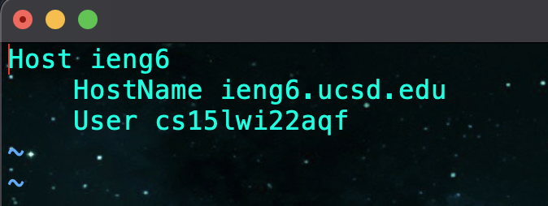
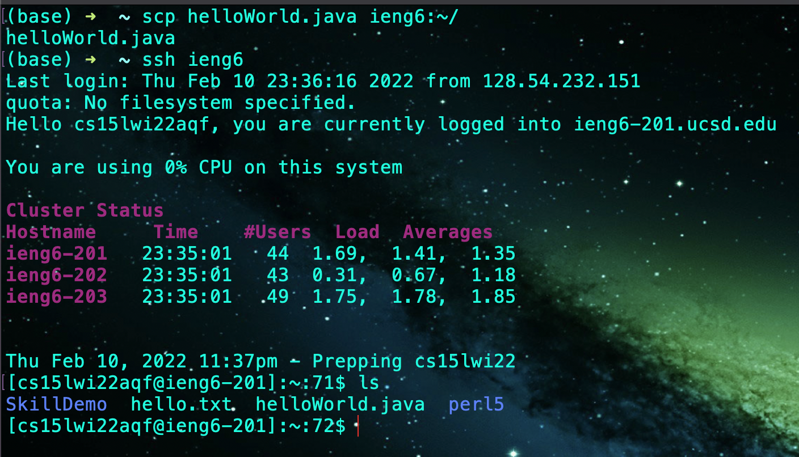

# Streamlining ssh Configuration

## Step 1 - creating a config file

The config file holds the ssh information such as the host and the username.
In this case we do not need a password because we have already setup the ssh_keygen.
Create this config file in the `.ssh` directory. It is a hidden folder so use `ls -a` to find it.

## Step 2 - logging in using the alias

This is what the login looks like. We use the alias `ieng6` without the hostname or username and `ssh` into the host.
This saves a significant amount of time and energy because we don't have to use our credentials to access the host.

## Step 3 - copying a file using scp and the alias

Here we created a simple helloWorld.java file and we are trying to `scp` it into the host directory.
Using the alias and a specific directory in the host system, we can seemlessly transfer the helloWorld.java file.
Here is the command we used: `scp helloWorld.java ieng6:~/`