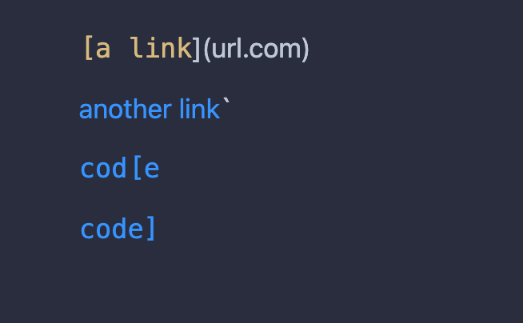
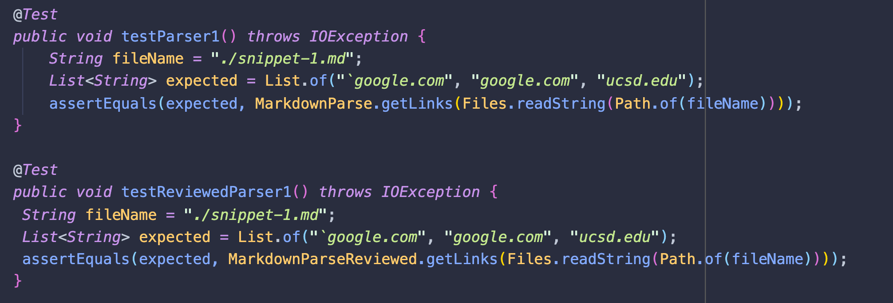
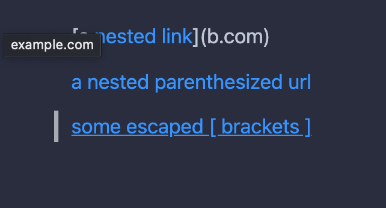
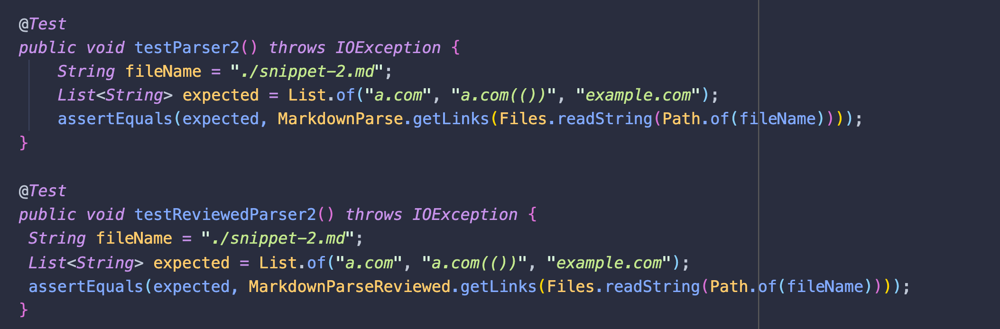
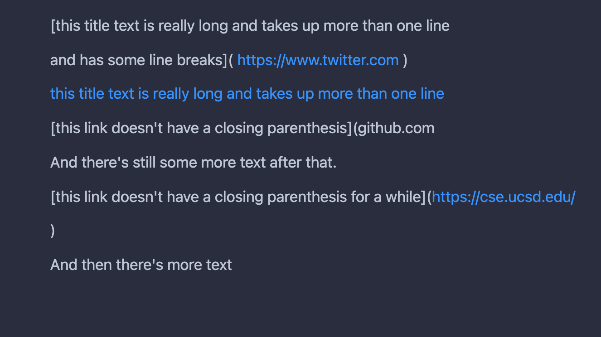
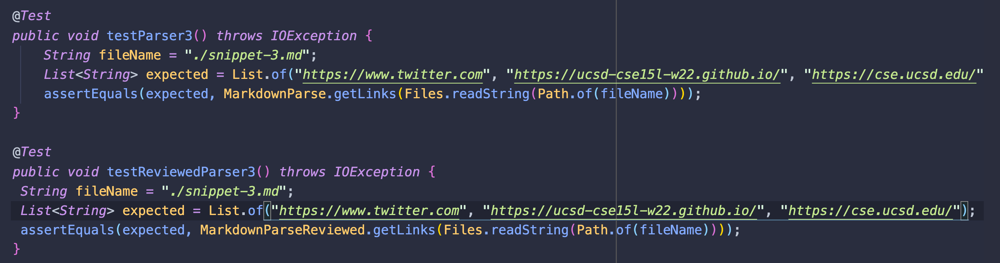

# Lab Report 8 - Testing different parsers
TLDR: All tests failed :(
## The test cases
Here are the test cases that the two parsers are going to be test on.
### Snippet 1

This test case should return 3 links: "`google.com", "google.com", "ucsd.edu"

Here are the JUNIT test we are using to compare the performance of both parsers on snippet 1.
```
1) testParser1(MarkdownParseTest)
java.lang.AssertionError: expected:<[`google.com, google.com, ucsd.edu]> but was:<[url.com, `google.com, google.com]>
```

```
4) testReviewedParser1(MarkdownParseTest)
java.lang.AssertionError: expected:<[`google.com, google.com, ucsd.edu]> but was:<[url.com, `google.com, google.com]>
```


### Snippet 2

This test case should return 3 links: "a.com", "a.com(())", "example.com"

Here are the JUNIT test we are using to compare the performance of both parsers on snippet 2.
```
2) testParser2(MarkdownParseTest)
java.lang.StringIndexOutOfBoundsException: begin -1, end 0, length 116
```

```
5) testReviewedParser2(MarkdownParseTest)
java.lang.AssertionError: expected:<[a.com, a.com(()), example.com]> but was:<[a.com, a.com((]>
```

### Snippet 3

This test case should return 3 links: "https://www.twitter.com", "https://ucsd-cse15l-w22.github.io/", "https://cse.ucsd.edu/"

Here are the JUNIT test we are using to compare the performance of both parsers on snippet 3.

```
3) testParser3(MarkdownParseTest)
java.lang.StringIndexOutOfBoundsException: begin -1, end 0, length 452
```

```
6) testReviewedParser3(MarkdownParseTest)
java.lang.AssertionError: expected:<[https://www.twitter.com, https://ucsd-cse15l-w22.github.io/, https://cse.ucsd.edu/]> but was:<[
    https://www.twitter.com
, 
    https://ucsd-cse15l-w22.github.io/
, github.com

And there's still some more text after that.

[this link doesn't have a closing parenthesis for a while](https://cse.ucsd.edu/


]>
```


## Questions section
- Do you think there is a small (<10 lines) code change that will make your program work for snippet 1 and all related cases that use inline code with backticks?
    - Yes, I think that this is a small solution. First you would create two variables that track the initial and final backtick, then you would check whether the parenthesis and brackets are within the backtick indices or not.

- Do you think there is a small (<10 lines) code change that will make your program work for snippet 2 and all related cases that nest parentheses, brackets, and escaped brackets?
    - No, I think that this would be a big solution. Instead of finding the next closed bracket if we look for all open and closed brackets within the first and last bracket we can figure out more accurate positions of characters. We will also have to keep track of nested brackets and brackets in series. Therefore, if we check if a closed bracked has a lower index than an open bracket we can distinguish between nested and series.

- Do you think there is a small (<10 lines) code change that will make your program work for snippet 3 and all related cases that have newlines in brackets and parentheses? 
    - No, I think this is a big solution. We will have to check for characters between lines which mean we might have to track multiple variables between loop iterations.