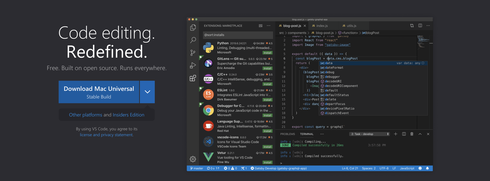
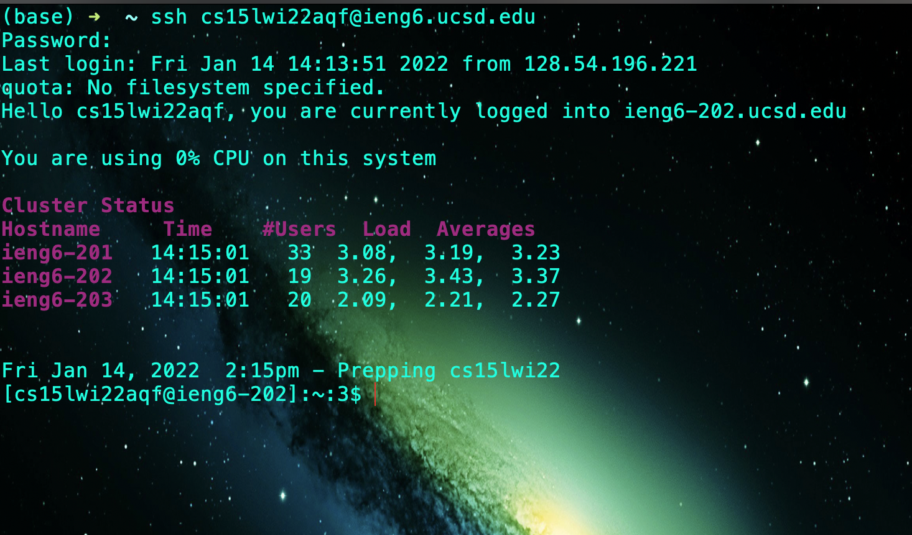
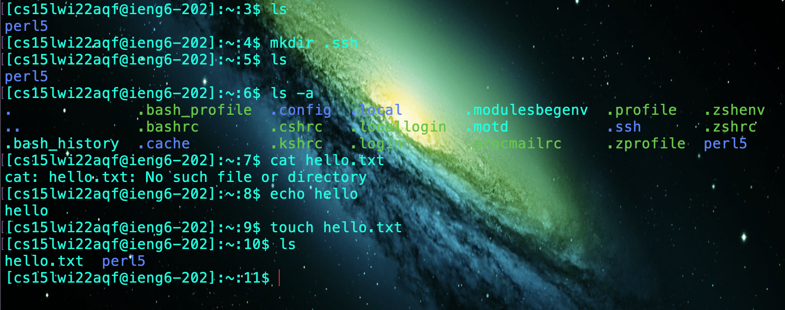
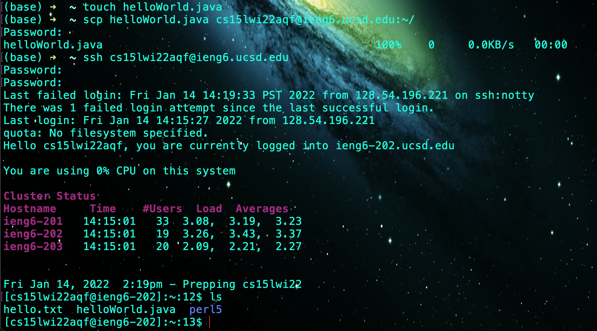
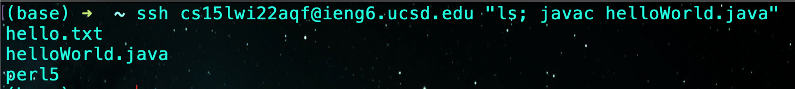

# How to log into your course-specific account on the `ieng6` server

### Step 1 - Downloading VSCode

First we have to download VSCode which will help us with writing code and interacting with the server.

Using this [link](https://code.visualstudio.com/) download and install VSCode.

### Step 2 - Remotely Connecting

Using your course-specific account you can access the `ieng6` server.

You can find the information at this [link](https://sdacs.ucsd.edu/~icc/index.php)

Open VSCode, or terminal, and type `ssh "youraccount@ieng6.ucsd.edu"`. This will prompt you to enter a password which is your school account password. If that doesn't work then you can reset the password at the previous link.

This command should result in a bunch of output and in the end you will be able to to interact with the server.

### Step 3 - Running Commands

Now that you have access to the `ieng6` server, you can run commands in the terminal that are executed on the server.

You can copy some of the commands that are in the image above or execute some of the listed commands.
- `ls`
- `mkdir myFolder`
- `touch hello.txt`

While you are connected to the server, make sure to run `mkdir .ssh` because we will be using this folder for future steps.

### Step 4 - Moving Files with `scp`

With the `scp` command you are able to copy files from a client machine to the server. This will be useful because you can edit files locally, test it, then upload them to the server for final execution.

First create a file to copy over, for example `touch helloWorld.java`.

Then run the command as shown in the image: `scp helloWorld.java cs15lwi22aqf@ieng6.ucsd.edu:~/`

At the end of the command, where the colon is, contains the directory for where the file you are copying will be pasted.

### Step 5 - Setting an SSH Key

You've probably noticed that everytime you use the `ssh` or `scp` command you have to log into the server. Generating a ssh key will let you access the server without actually typing your password everytime.

Type `ssh-keygen` into the terminal and follow the prompted steps. The result should look something like the image shown above.

Next we will have to use the `scp` command to transfer a file generated by the previous command. If you did not make a folder called .ssh from step 3, then you will have to ssh into the server and make it before proceeding.

Execute the command `scp /Users/tarunmurugan/.ssh/id_rsa.pub cs15lwi22aqf@ieng6.ucsd.edu:~/.ssh/authorized_keys`. Make sure to replace the local directory and account name from this command before executing it in your terminal.

### Step 6 - Optimizing Remote Running

Now that you have added your ssh key to the server, you won't have to use your password everytime you access the server.

We can now run commands through ssh as shown in the image above. After the `ssh "youraccount@ieng6.ucsd.edu"` command you can add quotes and execute local commands like `ls` or `cd`.

Another convenient syntax for running commands is that you can use semicolons to execute multiple commands on one line. For example `javac helloWorld.java; java helloWorld` will compile and execute the `helloWorld.java` file.

If we put this together we can see that there is a reduction in keystrokes between writing down each command one by one and adding them together. When I first ssh into the server, compile, and run the java file I had 83 keystrokes. However, using ssh and the command line tools previously mentioned, I was able to execute the same process in 27 keystrokes. However, if you already write the command down and exit ssh, you can execute the same command again in 2 keystrokes. Just press the up arrow and enter ( ͡• ͜ʖ ͡•).