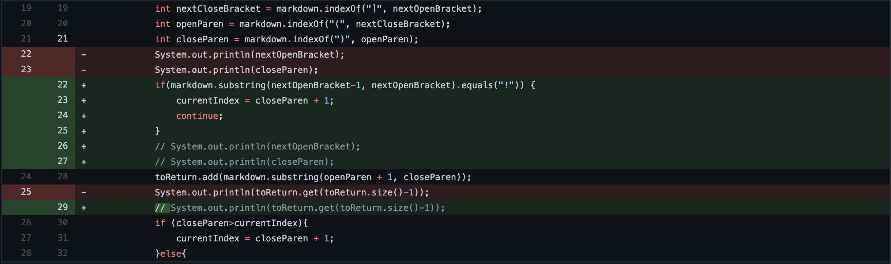

# Week 4 Lab Report - Bug Fixes
## Bug Fix #1

The first bug is an infinit while loop. The bug occurs because the script keeps looking for links and assumes that the final line of the md file ends with a link. As a result, the script is stuck in an infinit while loop until there is not enough space in the heap. Here is the link to the test file. [test file link](https://github.com/tarunm20/markdown-parse/blob/main/test-file2.md)

```
(base) ➜  markdown-parse git:(main) ✗ java MarkdownParse test-file2.md
Exception in thread "main" java.lang.OutOfMemoryError: Java heap space
        at java.base/java.util.Arrays.copyOfRange(Arrays.java:3821)
        at java.base/java.lang.StringLatin1.newString(StringLatin1.java:769)
        at java.base/java.lang.String.substring(String.java:1912)
        at MarkdownParse.getLinks(MarkdownParse.java:18)
        at MarkdownParse.main(MarkdownParse.java:26)
```

## Bug Fix #2

The second bug is not a runtime or compile time bug, but a conceptual bug. Although the script works the way we programmed it to we only want hyperlinks and not image links. Therefore, the fix looks for the exclaimation mark in front of the brackets. The link to the test file is here [test file link](https://github.com/tarunm20/markdown-parse/blob/main/test-file4.md)

```
java MarkdownParse test-file4.md
[www.google.com, image.png]
```

## Bug Fix #3

The third bug is an index out of bounds exception. The bug occurs because it is checking index - 1 for each loop but when index = 0 the error is thrown. The fix is that it checks if nextOpenBracket - 1 is "!" instead of the current index. The test file link can be found here [test file link]()

```
(base) ➜  markdown-parse git:(main) ✗ java MarkdownParse test-file3.md
Exception in thread "main" java.lang.StringIndexOutOfBoundsException: String index out of range: -1
        at java.base/java.lang.StringLatin1.charAt(StringLatin1.java:48)
        at java.base/java.lang.String.charAt(String.java:711)
        at MarkdownParse.getLinks(MarkdownParse.java:22)
        at MarkdownParse.main(MarkdownParse.java:32)
```