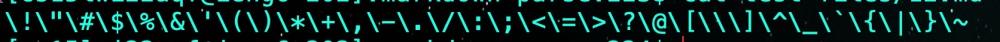
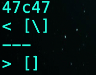
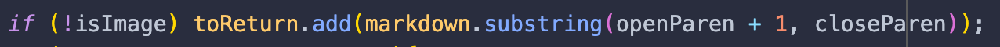
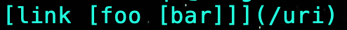
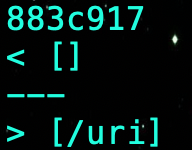
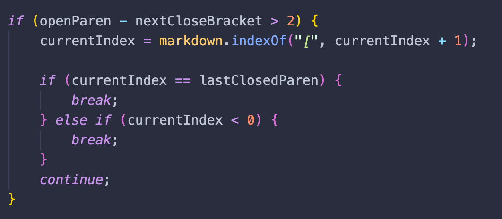

# Finding differences in parsers
## Intro
In this report we will be looking into the cse15l parser and my parser. We will compare the outputs of both parsers and determine which parsers returned an incorrect output and what potential bugs there are.

I used the diff command on both the results of the parsers to find the bugs. I did this by piping a bash script output into `results.txt` for both parsers and compared the two.

## Test 1
This is the first test case 

Here are the results for the two parsers

The expected output for this test case is `[]`. My parser failed to return the expected result but the other parser didn't, so for this test case my parser has a bug and the other one doesn't.

The problem with the code is that it is only checking for whether the line has the necesary characters rather than whether they are used for a link or not.

This is the line that needs to be fixed. It's only checking if the link is not an image rather than whether the parenthesis and brackets are used for a valid link.
I think one way to fix this bug is to check the length between the `()` and `[]`. 
For most cases, if the writer intended to use a link they would make it closer together like this ``.

## Test 2
This is the second test case 

Here are the results for the two parsers

Although the test case looks weird the `/uri` is considered a link. Therefore, there is something wrong with my parser and the other parser had the correct implementation. The expected result was `[/uri]`. T

Here is the code that results in the error

The problem is that the loop is entering the break statement before it can add the link to the list that is going to be returned. Therefore, the bug is in this code block.